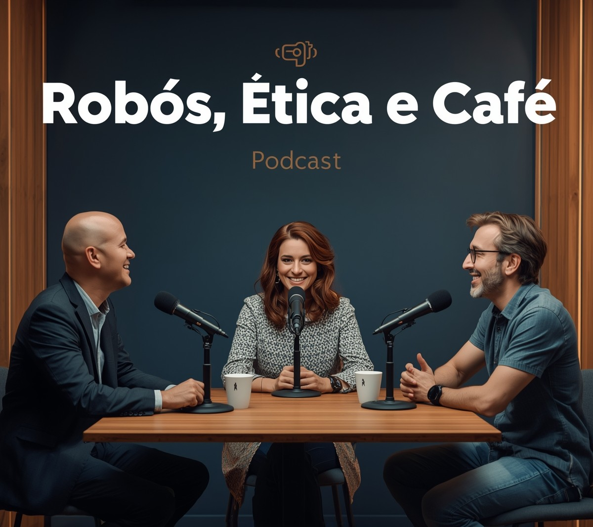

# 🎙️ Robôs, Ética e Café: um diálogo entre o otimismo tecnológico e o ceticismo humano

> **Um podcast criado com IA sobre os dilemas éticos e filosóficos da Inteligência Artificial.**

> **Este podcast foi desenvolvido como parte do curso “Criando um Podcast com IAs Generativas”, oferecido pela [DIO](https://www.dio.me/) (Digital Innovation One) e ministrado pelo expert [Felipe Aguiar](https://github.com/felipeAguiarCode) .**

## ☕ Sobre o podcast

**Robôs, Ética e Café** é um episódio de podcast que explora, de forma leve e reflexiva, as fronteiras entre **tecnologia, ética e humanidade**.  
A narrativa se desenrola como uma conversa de café entre uma jornalista e dois especialistas com visões opostas sobre o avanço da Inteligência Artificial.

Com uma proposta **jornalística e de entretenimento**, o episódio combina **argumentos técnicos, filosóficos e éticos**, proporcionando ao ouvinte uma imersão nos principais debates que moldam o futuro da IA.

---

## 🎧 Personagens

| Personagem | Descrição |
|-------------|------------|
| **Ana Paula Duarte** | Jornalista e mediadora da conversa. Representa a curiosidade e o equilíbrio entre os dois pontos de vista. Conduz o diálogo com empatia, promovendo perguntas provocativas e reflexivas. |
| **Alan Tavares** | Especialista em Inteligência Artificial. Didático e otimista, defende a IA como ferramenta de progresso e inovação, destacando seu potencial para melhorar a vida humana se usada com responsabilidade. |
| **Denis Rocha** | Filósofo e sociólogo da tecnologia. Cético e reflexivo, alerta sobre os riscos da automação, a perda de empregos e as implicações éticas de máquinas que tomam decisões humanas. Representa o lado mais crítico e humanista do debate. |

---

## 🧠 Temas abordados

- Ética e responsabilidade no desenvolvimento da IA  
- Vieses algorítmicos e justiça digital  
- O impacto da automação no mercado de trabalho  
- Filosofia da tecnologia e consciência das máquinas  
- Medos inspirados na ficção científica (como *Exterminador do Futuro* e *Matrix*)  
- O papel da empatia humana na era das inteligências artificiais  

---

## 🛠️ Tecnologias e ferramentas utilizadas

| Etapa | Ferramenta | Descrição |
|-------|-------------|-----------|
| **Roteiro** | 🧩 [ChatGPT (OpenAI)](https://chatgpt.com/) | Criação do roteiro completo do episódio, com falas, pausas e marcações de entonação. |
| **Geração de Voz** | 🗣️ [Typecast.ai](https://typecast.ai) | Criação das vozes realistas dos três personagens, com diferentes tons e expressões. |
| **Edição e Mixagem** | 🎬 [CapCut](https://www.capcut.com) | Edição do áudio, inserção de vinhetas, trilha sonora e ambientação sonora de café. |
| **Capa do Podcast** | 🎨 [Leonardo.ai](https://leonardo.ai/) | Criação da arte de capa com temática tecnológica e jornalística. |

---

## 💬 Estrutura do episódio

1. **Abertura** — Introdução ao tema e aos participantes  
2. **Debate** — Confronto de ideias entre otimismo e ceticismo  
3. **Reflexão** — Discussão sobre ética, consciência e empatia  
4. **Encerramento** — Mensagem final sobre equilíbrio entre progresso e humanidade  

Duração aproximada: **5 minutos**

---

## 🧩 Mensagem principal

> A Inteligência Artificial não é apenas uma questão tecnológica, mas **um espelho da nossa própria humanidade**.  
> O verdadeiro desafio talvez não seja ensinar máquinas a pensar, e sim lembrar os humanos de sentir.

---

## 📚 Créditos e autoria

Projeto criado como parte de um **curso de Inteligência Artificial**.

- 🎙️ **Roteiro:** ChatGPT (OpenAI)  
- 🗣️ **Vozes geradas por IA:** Typecast.ai  
- 🎧 **Edição:** CapCut  
- 🎨 **Capa:** Leonardo.ai  
- ✍️ **Criação e direção:** Brenda G. Gouveia 

---

## 📢 Ouça agora

> 🔗 *[Para baixa-lo clique aqui](https://github.com/brenda-gouveia/Podcast_sobre_IA/blob/main/output/audio_sintetizado.MP3)*  

---

## 🧭 Licença

Este projeto é de uso educacional e experimental.  
Os áudios e o roteiro foram criados com o apoio de ferramentas de IA, respeitando o uso ético de inteligência artificial e direitos autorais de trilhas e vozes.

---